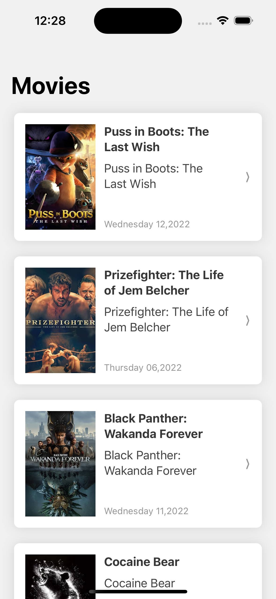
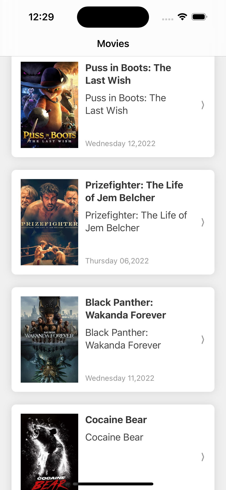

# MoviesApp

MoviesApp application with movies listing and detail screen using MVVM + SwiftUI

## Key Features
- Movies listing screen using TMDB api [Discover Movies](https://developers.themoviedb.org/3/discover/movie-discover)
- Scroll movies with pagination results
- Movie detail screen 

## Screenshots
<table>
    <td></td>
    <td></td>
    <td></td>
</table>

## Technologies
- Swift language
- SwiftUI for UI design
- MVVM 
- Async await for asynchronous network calls
- Repository layer for fetching/preparing data 
- Unit testing with XCTest for ViewModel and Repository

## Requirements
- Swift 5.5+
- XCode 14+
- iPhone OS
- iOS Version 16+
- SPM
